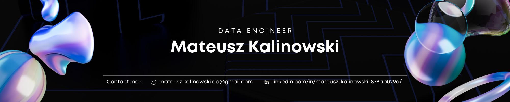

##
<h1 align=left>
    <picture>
      <source media="(prefers-color-scheme: dark)" srcset="https://readme-typing-svg.herokuapp.com?font=JetBrains+Mono&size=24&weight=600&center=false&vCenter=true&duration=4000&pause=1000&color=E6EDF3&lines=Hi+👋!+My+name+is+Mateusz!+🎓&width=500&height=25"" />
      <source media="(prefers-color-scheme: light)" srcset="https://readme-typing-svg.herokuapp.com?font=JetBrains+Mono&size=24&weight=600&center=false&vCenter=true&duration=4000&pause=1000&color=24292F&lines=Hi+👋!+My+name+is+Mateusz!+🎓&width=500&height=25"" />
      
  </picture>
</h1>

**`Data Engineer`**
**`DevOps`**

💻  Data Engineer -  I deal with data processing, analysis and optimization.  I create efficient ETL pipelines and automate data-related processes as well as develop machine learning models. ☁️ DevOps & Cloud - I'm developing my skills in CI/CD, monitoring and cloud infrastructure management.  I've got most of it down, but I'm still learning.  💭 I feel great about Big Data and develop my skills at every opportunity.  I try to share my passion for data during my journey and learning the cloud.  🚀 I'm pursuing a master's degree in Big Data at Warsaw School of Economics, Poland 📜 I have a Bachelor's degree in Finance and Accounting at the University of Warsaw, Poland 🧠 Currently learning Cloud technologies and working on my web portfolio.

   
 
      
      
      
      
   

## ⚡ Languages and Tools
<h3 align="left">
  
  
  
  
  
  
  
  
  
  
  
  
  
  
  
  
  
  
  
  
  
  
  
  
  
  
  
  
  
  
  
  
  
  
  
  
  
  
  
  
  
  
  
  
  
  
  
  
  
  
  
  
  
  
  
  
  
  
</h3>

## 📊 Stats

  <picture>
    <source media="(prefers-color-scheme: dark)" srcset="https://leetcard.jacoblin.cool/Kalink0?theme=dark&font=JetBrains%20Mono&ext=heatmap" />
    <source media="(prefers-color-scheme: light)" srcset="https://leetcard.jacoblin.cool/Kalink0?theme=unicorn&font=JetBrains%20Mono&ext=heatmap" />
    
  </picture>
  <picture>
    <source media="(prefers-color-scheme: dark)" srcset="https://github-readme-stats.vercel.app/api?username=mateusz-kalinowski-dev&count_private=true&show_icons=true&theme=dark" />
    <source media="(prefers-color-scheme: light)" srcset="https://github-readme-stats.vercel.app/api?username=mateusz-kalinowski-dev&count_private=true&show_icons=true&theme=catppuccin_latte" />
    
  </picture>

  <picture>
    <source media="(prefers-color-scheme: dark)" srcset="https://raw.githubusercontent.com/mateusz-kalinowski-dev/mateusz-kalinowski-dev/output/github-snake-dark.svg" />
    <source media="(prefers-color-scheme: light)" srcset="https://raw.githubusercontent.com/mateusz-kalinowski-dev/mateusz-kalinowski-dev/output/github-snake.svg" />
    
  </picture>

